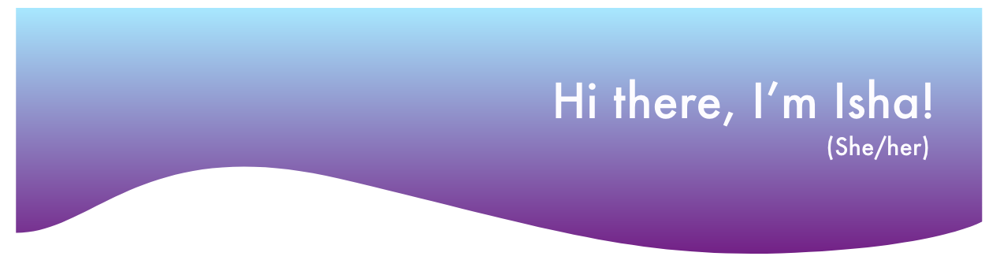

I'm a senior at Ithaca College studying Computer Science. 

🔭 I’m currently working on building generative systems to create music & art

🌱 I’m currently learning to master my skills of Data Science, UX/UI, & SWE.

🤝 I’m looking for help with New Project ideas for iOS App
 
🙋 Languages & Tools I Enjoy Using are Python, React, Javascript, Git
 
💡 Fields I'm Interested In: Product Mngmt., Data Science, Machine Learning, UX/UI, Full Stack Dev., Mobile Dev.

💻 All of my projects are available on [GitHub](https://github.com/ishasharmax) 

📝 I regularly write articles on [Medium](https://ishasharmax.medium.com/)

📫 You can reach me on [LinkedIn](https://www.linkedin.com/in/ishasharmax/) or email me @ 1999sharma19@gmail.com

📄 Know about my experiences through my [resume](https://drive.google.com/file/d/1rk0T6nHqHDE2FqbGsJZ7dtyeB7lbSd8w/view?usp=sharing)

### My Skills

 
           

### My stats

 

  
<b>Connect with me</b>

   

   &nbsp;   &nbsp;  &nbsp;   &nbsp;  
 

      

