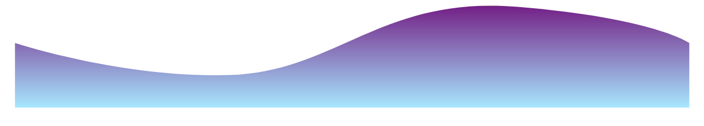

🔭 I’m currently working on building generative systems to create music & art

🌱 I’m currently learning to master my skills of Data Science, UX/UI, & SWE.

🤝 I’m looking for help with New Project ideas for iOS App
 
🙋 Languages & Tools I Enjoy Using are Python, React, Javascript, Git
 
💡 Fields I'm Interested In: Product Mngmt., Data Science, Machine Learning, UX/UI, Full Stack Dev., Mobile Dev.

💻 All of my projects are available on [GitHub](https://github.com/ishasharmax) 

📝 I regularly write articles on [Medium](https://ishasharmax.medium.com/)

📫 You can reach me on [LinkedIn](https://www.linkedin.com/in/ishasharmax/)

📄 Know about my experiences through my [resume](https://drive.google.com/file/d/1ZV3Sofl8ii8CeYVWFb7c4bKWcSe6Uv8k/view?usp=sharing)

### My Skills

 
      <a>

 

### 🧰 Languages & Tools

 

 

 
### About Me
🖌️  I make illustrations and graphic designs  
🎹  I find joy in playing musical instruments such as Piano, Ukulele, and Guitar, and singing 
🦋  I love exploring, trying new things, and talking to different people  

 

##

 

### My stats

 

  
<b>Connect with me</b>

   

   &nbsp;   &nbsp;  &nbsp;   &nbsp;  
 

      

